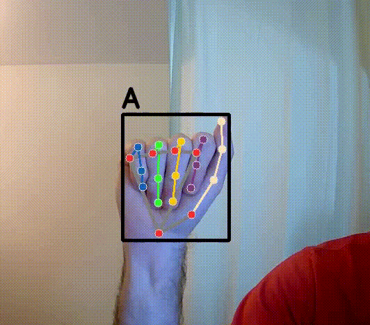
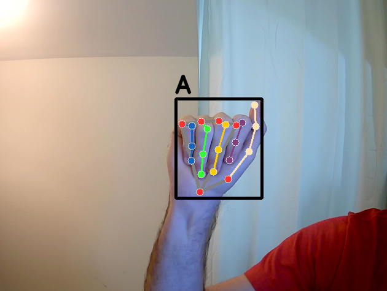
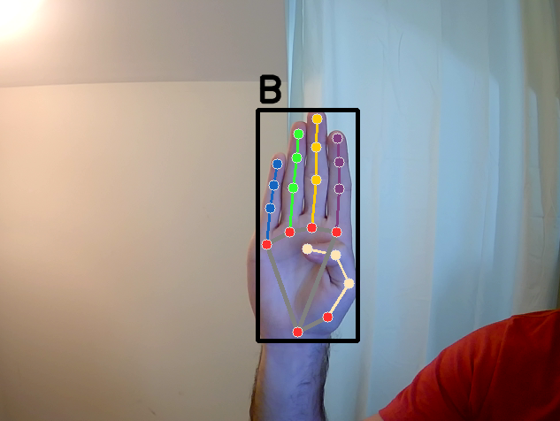
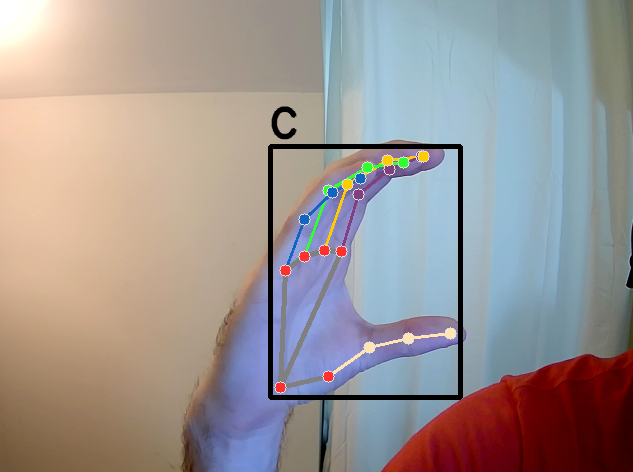
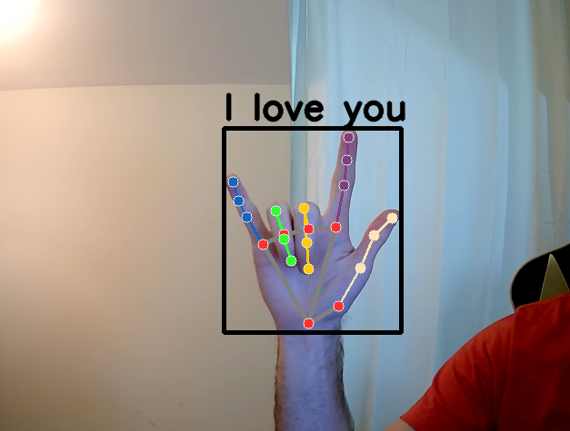

# Sign Language Detection

  

## Table of Contents

## Overview
This project aims to create a real-time sign language detection system using a custom dataset of hand signs. This involves capturing multiple images of different hand signs, extracting hand landmarks for feature representation, and training a classification model to predict the sign. The trained model is then deployed for real-time sign language detection.

## Components
### Data Collection
A custom script is developed to record multiple images of the hand signs. This implementation uses the signs for A, B, C, and "I love you", although any number of static hand signs could be used.

### Feature Extraction
Hand landmarks serve as essential features that capture the unique characteristics of each sign. These landmarks are extracted using MediaPipe's hand landmark detection.

### Model Training
The extracted hand landmarks are used as input features, and the corresponding sign labels (A, B, C, "I love you") as target variables. I use a random forest classifier due to its ease of use, although this could also be tinkered with.

### Real-time Inference
The trained model is deployed to perform real-time sign language detection. The deployed system can capture live video feed, extract hand landmarks, and classify the detected signs in real-time.

## Technologies Used

## Project Structure
- 📂 **examples:** prediction examples
- 📂 **src**
    - 📂 **utils**
        - 📄 **`config.py`:** configuration file with shared variables
    - 📄 **`classifier.py`:** trains and evaluates model on generated data
    - 📄 **`data_generation.py`:** generates training data by recording signs
    - 📄 **`extract_features.py`:** calculate hand landmarks as features
    - 📄 **`inference.py`:** real-time inference of signs
- 📄 **requirements.txt:** project dependencies

## Usage
1. Install dependencies with `pip install -r requirements.txt`.
2. Modify `config.py` for your own purposes.
3. Run `data_generation.py` to generate your own training data. This will record images of you making each sign.
4. Run `extract_features.py` to create and save the dataset.
5. Run `classifier.py` to train and evaluate the model.
6. Run `inference.py` to run real-time inference of sign languages.
   
**Notes:** 
- Step 3 can be replaced with any labeled sign language dataset.
- The pipeline will save the pickled dataset and model parameters, so these only have to be run once.

## Examples

  
  
  
  

## Challenges

## Acknowledgements
- [MediaPipe's Hand Landmark Detection](https://developers.google.com/mediapipe/solutions/vision/hand_landmarker)
- [Computer Vision Engineer's Tutorial Video](https://www.youtube.com/watch?v=MJCSjXepaAM)
